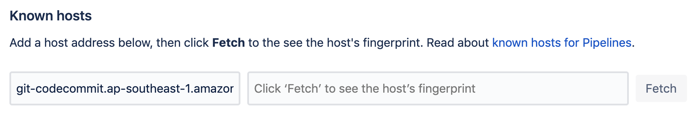

There are some ways to mirror source code from Bitbucket (or any git providers) to AWS Codecommit. Some of these are:

- Maintain an external application (Lambda function or CI server for example) to be notified on any repo events such as: push, fork, updated, etc. 
That application then will clone the repo from Bitbucket (Source) and mirror it to Codecommit (Target).

- Leverage Bitbucket Pipelines to mirror content to Codecommit. This approach we do not need to maintain connection between
Bitbucket and external application, reduce much effort for monitoring and maintaining availability of application.
This approach is preferred one to show in this tutorial.

### Prerequisite

1. Ready repository from Codecommit.
2. IAM user has permission to access to that target repository. 
3. Bitbucket account which has `admin` access on source repository.


### Enable Pipelines

By default Bitbucket Pipelines is not enabled for every repository. Go to `Repository Settings` > `PIPELINES` > `Settings` to enable it.

### Setup an SSH key

Pipelines uses an SSH key pair and known host information to securely connect to other services and hosts. We need to setup a key pair and register
it with Pipelines. Once registered, SSH key pair will be passed to every Pipelines build container at `/opt/atlassian/pipelines/agent/ssh/id_rsa` and be
used as runtime user identity by default.

**To generate a new SSH key pair:**

1. In the repository **Settings**, go to **SSH keys** under 'Pipelines'.
2. Click **Generate keys** to create a new SSH key pair.

**To add an existing key pair:**

You can use an existing key pair if your key requirements differ from the Bitbucket 2048-bit RSA keys.

For security reasons, you should never add your own personal SSH key – you should use an existing bot key instead.

> 1. Any SSH key you use in Pipelines should not have a passphrase.
> 2. Bitbucket Pipelines supports one SSH key per repository

### Update the known hosts

Pipelines provides a way for you to store, and inspect, the fingerprint of a remote host, along with the host address. This allows you to visually verify that the public key presented by a remote host actually matches the identity of that host, to help you detect spoofing and man-in-the-middle attacks. It also means that future communications with that host can be automatically verified.

In the repository Settings, go to SSH keys, and add the address for the known host. Click Fetch to see the host's fingerprint:



Host name should be in format `git-codecommit.aws-region.amazonaws.com`. For example: `git-codecommit.ap-southeast-1.amazonaws.com`.

### Add the public key to IAM user

Login as IAM user. Go to `My security credentials` and upload SSH public key in `AWS CodeCommit credentials` tab. Once you uploaded public key,
let's note down the **SSH key ID**, so it can be used on next step.

### Compose `bitbucket-pipelines.yml`

Below is a minimal script to mirror content from Bitbucket to Codecommit repository.

```yaml
image: 'atlassian/default-image:2'
pipelines:
  default:
    - step:
        script:
          - echo "Host git-codecommit.*.amazonaws.com" >> ~/.ssh/config
          - echo "User YourSSHKeyId" >> ~/.ssh/config
          - git remote add codecommit ssh://git-codecommit.ap-southeast-1.amazonaws.com/v1/repos/your-repo
          - git push codecommit ${BITBUCKET_BRANCH}
```

> For security reason, you should setup environment variables for **YourSSHKeyId** and **Codecommit repository** and reference to it in `bitbucket-pipelines.yml`.
 
If everything is ok, your Codecommit repository will get populated automatically on every change from Bitbucket repo.